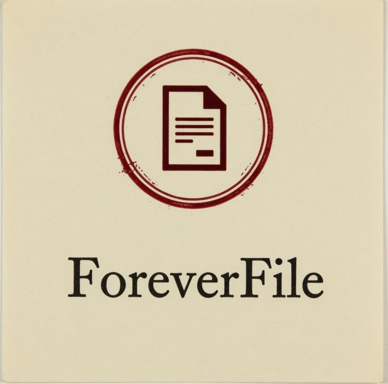

<p align="center">
  
</p>

<p align="center">
  <strong>A permanent place for important files.</strong><br>
  Publish a public record that cannot silently change.
</p>

<p align="center">
  <a href="https://foreverfile.xyz">foreverfile.xyz</a>
  ·
  Built with <a href="https://svenjs.xyz">SvenJS 3.2.1</a>
</p>

---

Cloud folders get edited. Links rot. “The file” becomes a different file, and nobody can prove it.

ForeverFile publishes **one exact version** of a file as a public record. Anyone with the link can retrieve it. Anyone with a copy can check that it still matches. The record does not live on this website — this site is a window onto a long-lived network.

**Public.** Anyone with the record can view or download it.  
**Unchanged.** This version cannot silently become a different file.  
**Persistent.** Built to outlast ordinary hosting and single accounts.

You will review the consequences before anything is written. The publication key stays in the current browser tab. ForeverFile never receives it.

### What this is not

Not private. Not a backup. Not reversible. Not crypto.

If it should stay confidential, do not publish it. Deleting a bookmark does not unpublish the file.

---

## Give this to an LLM

Paste the prompt below into ChatGPT, Codex, Claude, or another assistant when you want help **using** ForeverFile — preparing a file, publishing it, sharing the record, or verifying a copy later.

```text
Help me use ForeverFile (https://foreverfile.xyz) to publish and later verify an exact file.

ForeverFile is a browser app that writes a public, unchangeable record of one file to Arweave. The site is only a window onto that record.

Facts you must not invent around:
- Publishing is public. Anyone with the record URL can view or download the file.
- This version cannot be edited, overwritten, or silently swapped. A later file is a new record.
- Deleting a link or this website does not remove the file from the network.
- The Arweave JWK (often wallet.json) is pasted or chosen in the tab. It must never be sent to a ForeverFile server, committed to git, or written to disk by you.
- Identity is SHA-256 of the file bytes. Change one byte, and it is a different record.
- Uploads are tagged App-Name: foreverfile so records from the same key can be listed.
- Network fee is paid in AR on Arweave L1 from the key in the tab.

Walk me through, in order:
1. Whether this file should be published at all (private, confidential, or replaceable files should stop here).
2. What I will see on /publish: choose file → review three acknowledgements → authorize with the key → write the record.
3. How to share foreverfile.xyz/f/<id> and how someone else verifies on /verify (paste the link, optionally choose a local copy).
4. How to list records later on /library with the same key, then lock the key.

If I paste a path, filename, or error, diagnose it against those facts. Do not offer a “private ForeverFile”, a hosted wallet, or a way to edit a published record.
```

---

## Use it

1. Open [foreverfile.xyz/publish](https://foreverfile.xyz/publish) and choose a file. The fingerprint is hashed in your browser.
2. Confirm it will be public and unchangeable. Authorize with an Arweave key that has enough AR for the one-time network fee.
3. Keep the record URL. Anyone can open it; anyone can verify a local copy against it.

To check a file later: [foreverfile.xyz/verify](https://foreverfile.xyz/verify) — paste the link, optionally choose the copy on disk.

---

## Run it locally

Requires Node.js 20.9 or newer. An Arweave JWK with AR is needed only if you publish.

```shell
npm install
npm run dev
```

Open [http://localhost:3000](http://localhost:3000).

```shell
npm test
npm run build
npm run preview
```

The private key stays in memory for the tab. Lock it or close the tab to drop it. Do not commit `wallet.json`.

### How a publish works

1. The file is hashed locally (SHA-256).
2. You acknowledge that it is public, unchangeable, and not confidential.
3. The JWK never leaves the tab. The file is signed locally and uploaded in chunks to Arweave L1.
4. The transaction is tagged `App-Name: foreverfile` so that key’s records can be listed via GraphQL.

Unknown record URLs render an in-page missing state (HTTP 200) rather than a server 404.

### Deploy

Vercel is configured as a Vite static site (`dist`). Direct visits to `/f/:id` are rewritten to a prerendered record shell; the record itself is loaded from the public network in the browser.
